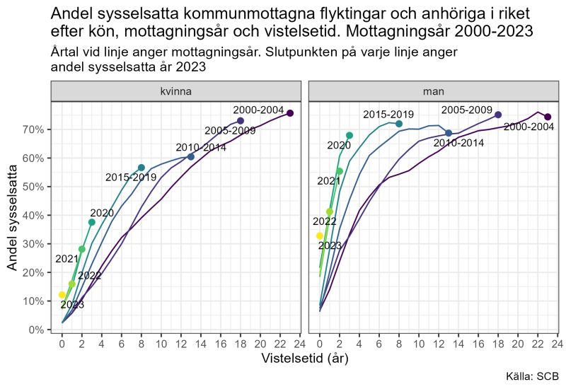

Runt 2010 skedde ett skifte i hur många år det tar för flyktingar och anhöriga att få arbete. Det finns en tydlig trend som visar att det går allt snabbare för flyktingar att få jobb. Kanske är det därför det finns ett antal studier som räknar medelvärde för tid till arbete som bygger på medelvärde från 1990 och framåt. Då kan man nämligen undvika att visa att det finns en trend i statistiken som visar att tiden in till arbete blir allt kortare.

Diagrammet nedan visar tid in till arbete efter vilket år flyktingarna blivit kommunplacerade. De som kommunplacerarades mellan åren 2000-2024 tog det nio år innan hälften var sysselsatta. För de som kommunplacerades 2020 tog det mindre än tre år.

{width="880"}

Men det är stora skillnader mellan män och kvinnor. Män får arbete betydligt snabbare. På lång sikt utjämnas dock skillnaderna. Kvinnor som kommunplacerades mellan 2000-2009 har i stort sett samma sysselsättningsgrad som män som kom under samma period.

Källa:

[Andel sysselsatta kommunmottagna flyktingar och anhöriga efter län, kön, mottagningsår och sysselsättningsår 2022 - 2023](https://www.statistikdatabasen.scb.se/pxweb/sv/ssd/START__AA__AA0003__AA0003B/MotFlyktLanBAS/)

[Antal sysselsatta kommunmottagna flyktingar och anhöriga efter antal år efter mottagning, kön och mottagningsår 1997 - 2024](https://www.statistikdatabasen.scb.se/pxweb/sv/ssd/START__AA__AA0003__AA0003B/KomMotForvBAS/)