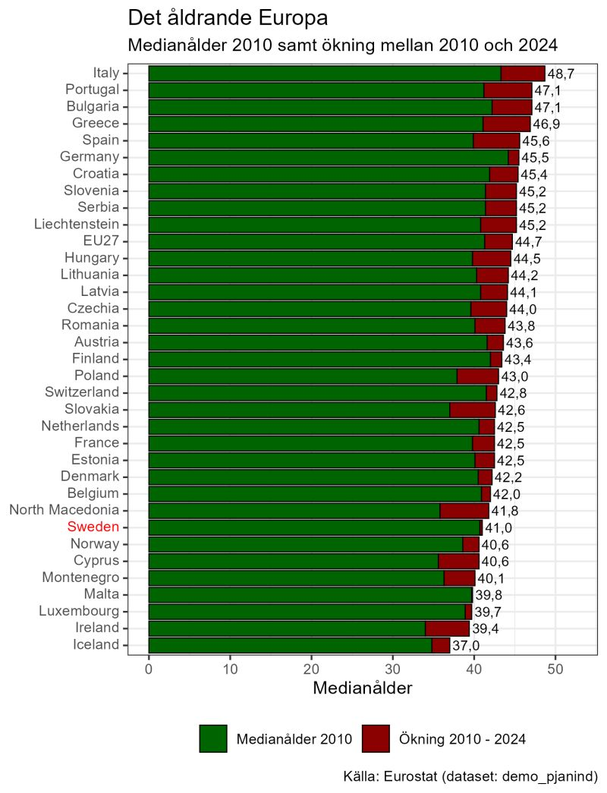

Sverige tillhör de länder som har lägst medianålder i Europa och har, tillsammans med Malta och Luxemburg, stort sett har oförändrad medianålder år 2024 jämfört med 2010. Detta är till stor del en följd av Sveriges stora invandring. Sverige har därmed en betydligt gynnsammare åldersstruktur än framför allt ett antal länder i sydeuropa.

Italien sticker ut som ett av länderna med högst medelålder. Italien har dessutom svårt att sysselsätta den förhållandevis lilla andelen av befolkningen som är i arbetsför ålder och tillhör bottenligan vad gäller sysselsättningsgrad.

{width="655"}