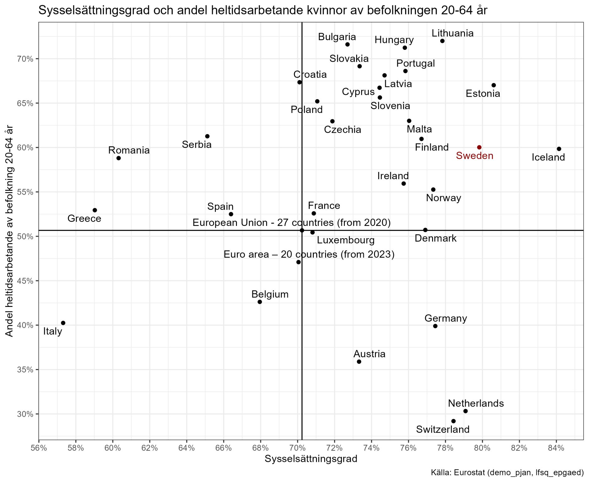

Många kvinnor i EU-länderna arbetar deltid, vilket kan bero på olika faktorer som familjeansvar, brist på heltidsjobb, brist på barnomsorg eller personliga preferenser. I Sverige är det dock vanligare att kvinnor arbetar heltid jämfört med många andra EU-länder. De länder som har hög andel deltidsarbetande kvinnor inkluderar Nederländerna, Tyskland och Österrike, där deltidsarbete är mer utbrett. I Sverige är det däremot vanligare att kvinnor arbetar heltid, vilket kan bero på en mer jämställd arbetsmarknad och bättre tillgång till barnomsorg.

Ett intressant undantag är att många av länderna i det forna östblocket, som Polen, Tjeckien och Slovakien, har en hög andel kvinnor som arbetar heltid. Detta kan bero på historiska och kulturella faktorer, där det under kommunisttiden var vanligt att både män och kvinnor deltog i arbetslivet. Därtill kommer att det finns ekonomiska faktorer som gör att kvinnor i dessa länder behöver arbeta heltid för att försörja sig själva och sina familjer.

{width="755"}