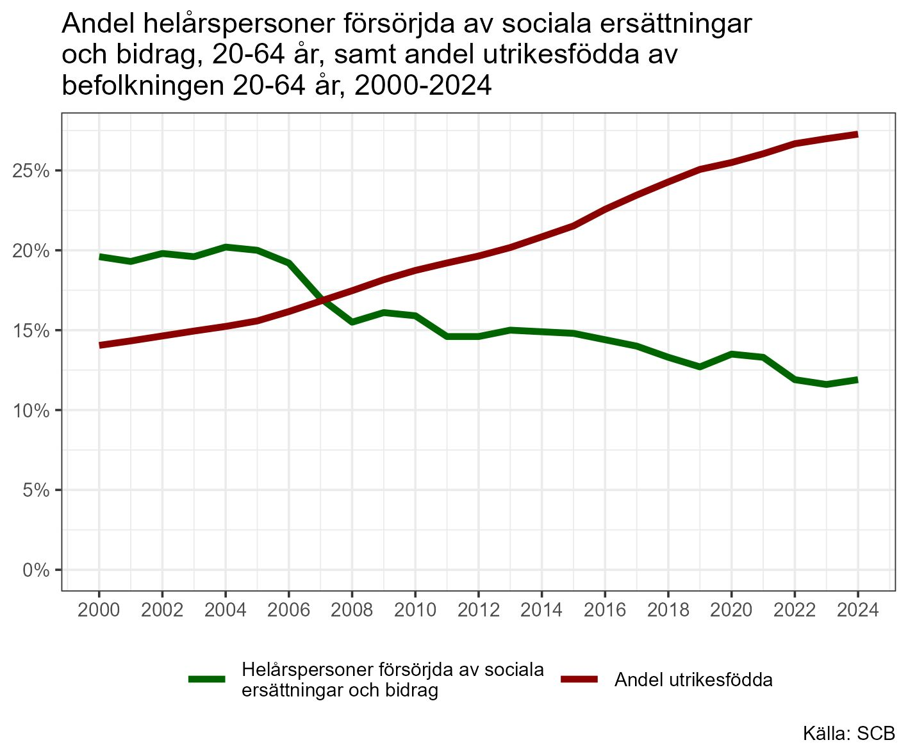

Väldigt många tycks leva i villfarelsen att en allt högre andel av befolkningen blir beroende av sociala ersättningar och bidrag i takt med att andelen invandrare av befolkningen ökar. Men så är inte fallet. Tvärtom är statistiken glasklar: Andelen "bidragsförsörjda" har minskat i takt med att andelen utrikesfödda ökat.

Den stora flyktingvågen i mitten av 10-talet tycks inte haft någon större inverkan på den sjunkande andelen av befolkningen som försörjs av sociala ersättningar och bidrag. Tvärtom fortsatte den sjunkande trenden.

Det finns två troliga förklaringar till den sjunkande andelen "bidragstagande". Den största förklaringen är sannolikt att en allt högre andel av befolkningen förvärvsarbetar. Den andra förklaringen är att det blivit svårare att kvalificera sig för att få tillgång till samhällets skyddsnät. Om vi studerar utrikesfödda, vilka är kraftigt överrepresenterade bland mottagare av ekonomisk bistånd kan vi se att andelen förvärvsarbetande varit stigande under lång tid. De senaste årens konjunkturnedgång har endast marginellt påverkat sysselsättningsgraden för utrikesfödda. Enligt SCB:s preliminära sysselsättningsstatistik (BAS) sjönk sysselsättningsgraden för utrikesfödda med en halv procentenhet mellan februari 2024 och februari 2025, men steg sedan med 0,6 procentenheter mellan februari 2025 och februari 2026.

{fig-alt="Diagram allt högre andel utrikesfödda av befolkningen i förvärvsarbetande ålder samtidigt som andelen försörjda av sociala ersättningar och bidrag sjunker stadigt."}

Källa:

[Sociala ersättningar och bidrag 1990-2025 (excel)](https://www.scb.se/hitta-statistik/statistik-efter-amne/hushallens-ekonomi/hushallens-inkomster-tillgangar-och-skulder/antalet-helarspersoner-som-forsorjdes-med-sociala-ersattningar-och-bidrag/pong/tabell-och-diagram/helarsekvivalenter/helarsekvivalenter-1990-2025/)