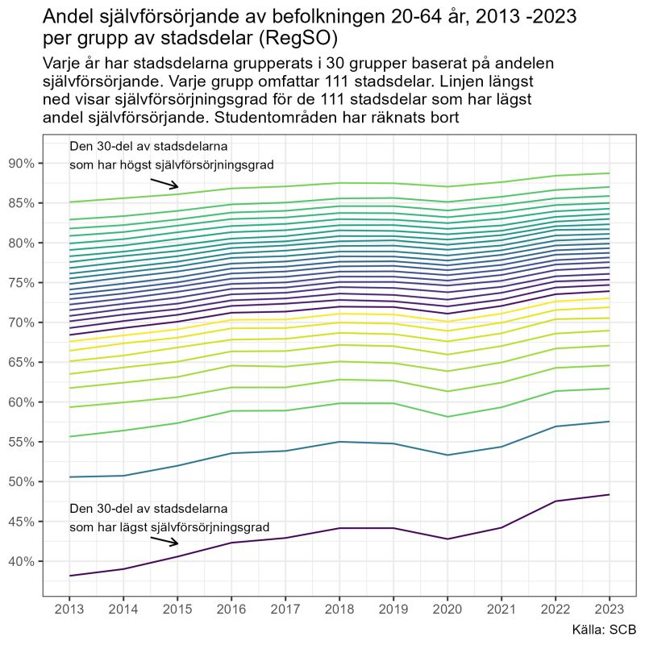
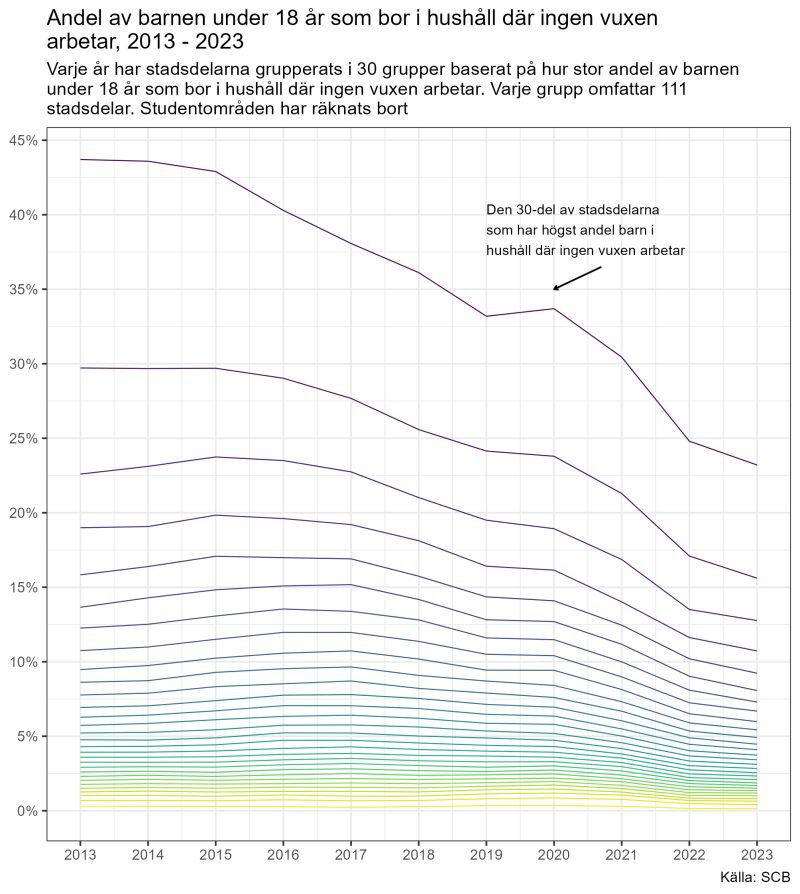

Många som gör sin röst hörd i den offentliga debatten tycks ha missat utvecklingen i de så kallade "utsatta områdena". Det är en av de mest seglivade myterna att det skulle vara en växande och allt mer problematisk grupp av områden där människor lever i utanförskap, kriminalitet och bidragsberoende. Men faktum är att arbetsmarknadssituationen har förbättrats avsevärt över tid.

Till att börja med har sysselsättningsgraden ökat kraftigt i stadsdelar med låg sysselsättningsgrad. Vi använder oss här av SCB:s indelning av Sverige i Regionala StatistikOmråden, RegSO, som i stort motsvarar stadsdelar när vi kommer in i städer).

{width="575"}

I den en trettiondel av RegSO-områdena som 1997 hade lägst sysselsättningsgrad arbetade 41 procent av invånarna. 2023 hade andelen stigit till 59 procent. Sysselsättningsgraden är fortfarande låg, men tillväxttakten är dramatiskt. Andelen sysselsatta har framför allt ökat sedan 2010 – vilket intressant nog sammanfaller med den stora ökningen av flyktinginvandringen.

Det är sant att det är många osäkra anställningar som ökat och att lönenivåerna är låga, men även *självförsörjningsgraden*, det mått som tidöregeringen ålagt SCB att mäta, visar på en stigande andel "självförsörjande" i de ormråden som har lägst självförsörjningsgrad. 2013 uppgick självförsörjningsgraden till 39 procent av befolkningen mellan 20-64 i den 30-del av RegSO-områdena som hade lägst självförsörjningsgrad. 2023 hade självförsörjningsgraden stigit till 48 procent.

{width="589"}

Ett sista mått vi ska granska är alla politikers favoritmått – Hur många barn lever i hushåll där en vuxen går till jobbet? Det visar sig att även det måttet ökat kraftigt. 2013 var det 43 procent av barnen under 18 år som bodde i hushåll där ingen vuxen var registrerad som sysselsatt i statistiken, när vi tittar på den 30-del av RegSO-områdena som hade högst andel barn i hushåll där ingen arbetar. 2023 hade andelen minskat till 23 procent.

{width="597"}

Alla de måtten vi tagit fram visar att det fortfarande finns tydliga problem i de ofta invandrartäta områden där få arbetar, men att det samtidigt har blivt markant bättre på relativt kort tid. Diagrammen speglar den övergripande utvecklingen mot att flyktingar kommer in på arbetsmarknaden allt snabbare, rekordlåga nivåer av befolkningen som lever på sociala ersättningar och bidrag och stigande "självförörjningsgrad". Ändå är det märkligt tyst i massmedia om denna utveckling.