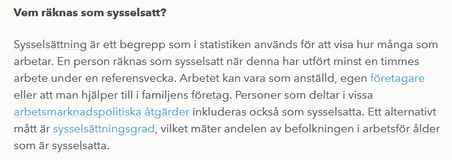
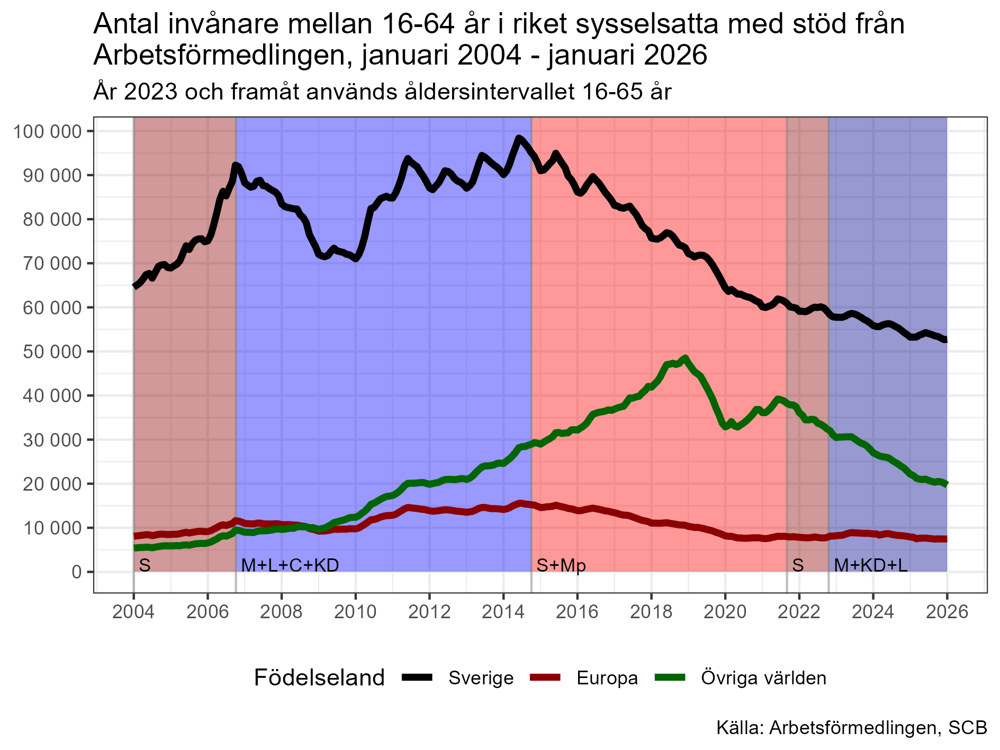
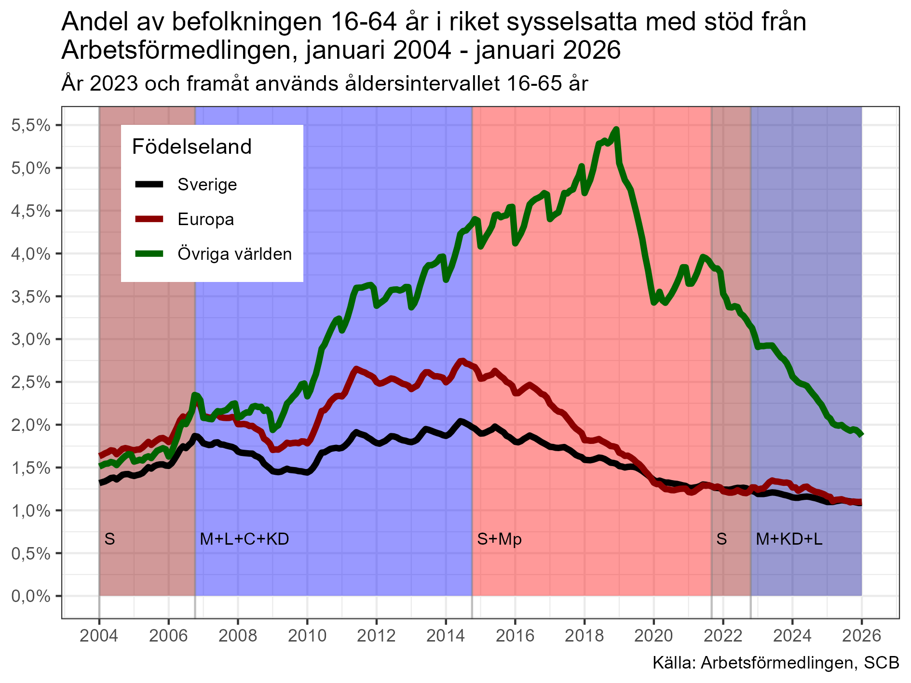
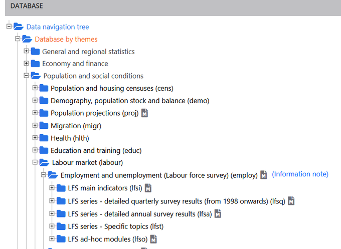

Det cirkulerar väldigt många okunniga kommentarer om vad "sysselsättning" är i arbetsmarknadsstatistiken. Vi tar det från början: *sysselsättning = förvärvsarbete*. För att vara sysselsatt måste man få *lön* *från en arbetsgivare* eller *arbeta i eget eller anhörigs företag*. Det är den definition som SCB använder i den officiella sysselsättningsstatistiken som kommer från Arbetskraftsundersökningarna (AKU).

Apokalypshögern brukar älska att citera Ekonomifakta om vad sysselsättning är:

Ofta åtföljs hänvisningen till Ekonomifakta av påståenden som "Värdelöst mått! Det räcker att jobba en enda timme!". "Man behöver inte ens få betalt!", "Det räcker att man är går på SFI en timme i veckan så är man sysselsatt!", "Det räcker att delta i en pysselsättning hos Arbetsförmedlingen 1 timme i veckan för att räknas som sysselsatt!".

De frågor man *inte* ställer sig är:

-   Hur många arbetar så lite som 1 timme i veckan? Är det relevant?

-   *Vilka* kan arbeta gratis och räknas som sysselsatta?

-   Är SFI och andra utbildningar verkligen "sysselsättning" i statistiken?

-   Vilka är de "vissa arbetsmarknadspolitiska åtgärder" som räknas som sysselsättning?

*Hur stor andel av de sysselsatta klassas som sysselsatta genom att arbeta väldigt få timmar?*

Det räcker att jobba en timme under mätveckan. Det är sant, men irrelevant eftersom ingen jobbar så lite (\<0,2% av de sysselsatta). I åldern 20-64 år är det 97% av de sysselsatta som arbetar minst 20 h/vecka och 83% som arbetar minst 35 h. Dessa andelar är i det närmast identiska för både inrikes- och utrikesfödda.

*Behöver man inte ens ha betalt för att jobba för att räknas som "sysselsatt"?*

Om man arbetar i ett familjeföretag så antas man få del av avkastningen utan att man får någon formell lön. Ett typiskt exempel är lantbruksföretag som av tradition tidigare oftast ägdes av mannen i familjen. Hustrun var formellt hemmafru, men jobbade större delen av tiden med lantbruket. Båda två levde på lantbruket, men det var *formellt* bara mannen som försörjdes av det. Så det stämmer att man inte behöver få betalt för att räknas som "sysselsatt" under förutsättning av att man arbetar i en anhörigs företag.

*Bidragsjobb då?*

Det är endast de insatser från Arbetsförmedlingen som sker i form av lönesubvention till arbetsgivare som gör att man räknas som "sysselsatt". Då har man *lön* (inte bidrag!) *från en arbetsgivare,* vilket överensstämmer med definitionen av "sysselsättning". Ungefär 35% av de som deltar i arbetsmarknadspolitiska åtgärder via Arbetsförmedlingen deltar i sådana insatser som gör att de räknas som "sysselsatta". I absoluta tal handlar det om knappt 100 000 personer, varav 60% får stöd pga nedsatt arbetsförmåga. Stöden höjer sysselsättningsgraden för befolkningen mellan 16-64 år med drygt 1,5 procentenheter. För gruppen födda utanför Europa höjs sysselsättningsgraden med ca 3 procentenheter. Ingen försumbar andel, men heller inte så många att det finns skäl att ifrågasätta sysselsättningsmåttet.

Ibland ser man påståenden om att deltagande i FAS 3 räknades som sysselsättning. Det stämmer inte eftersom de inblandade företagen var *anordnare* (inte arbetsgivare!) som inte betalade någon lön. Deltagarna ersattes oftast av aktivitetsstöd och i vissa fall av ekonomiskt bistånd från kommunen. De hade alltså bidrag och inte lön och uppfyllde därmed inte kriterierna för att räknas som sysselsatta.

Antalet personer som är "sysselsatta" via stöd från Af är kraftigt minskande. Det är inte heller så att det är en höger-vänster-fråga vilka regeringar som satsar på subventionerade tjänster.

{width="16cm"}

{width="16cm"}

*Räcker det att läsa SFI för att räknas som "sysselsatt"?*

Nej. Det är entydigt fel. Om man läser SFI är man inte "sysselsatt" eftersom det inte finns någon arbetsgivare. Om man läser en utbildning är man just i kategorin "Utbildning". Man är inte "sysselsatt", såvida man inte arbetar vid sidan om studierna.

*Håller regeringen på att manipulera statistiken?*

Man läser ibland påståenden om att regeringen ändrar definitioner och manipulerar statistiken. Det stämmer inte heller. Definitionerna inom arbetsmarknadsstatistiken regleras i en [ILO-resolution](https://www.ilo.org/global/statistics-and-databases/standards-and-guidelines/resolutions-adopted-by-international-conferences-of-labour-statisticians/WCMS_230304/lang–en/index.htm) som alla länder följer. Senaste upplagan är från 2013. Dessa definitioner preciseras ytterligare av EU:s statistikmyndighet Eurostat som säkrar att arbetsmarknadsstatistiken inom EU är jämförbar.

I ILO:s resolution kan man bland annat se att 1-timmesgränsen är en internationell standard och man kan se att de som får bidrag (inte lön!) från Arbetsförmedlingen inte räknas som "sysselsatta".

Man läser ibland att "sossarna" har hittat på "sysselsättning" som om det vore ett nytt begrepp. Det är naturligtvis inte heller sant. SCB har mätt "sysselsättning" med ungefär samma definition i alla fall i 50 år. Det finns tidsserier sedan 1970 i SCB:s öppna databas. (Jag har läst påstående om att mätningarna började redan 1960, men jag har inte kunnat verifiera det.)

*Sysselsättning borde heta förvärvsarbete!*

En sak som stör mig är att SCB valt att tala om "sysselsatta" och inte "förvärvsarbetande". Det hade minskat förvirringen runt sysselsättningsbegreppet som inte har samma betydelse i vardagsspråket som det har som statistiskt begrepp. På engelska heter det "employment".

*Tänk lite själva!*

Och tänk lite innan ni vidarebefordrar konstiga påstående. Om något låter för dumt för att vara sant så är det oftast inte det. En typiskt sådant sak är alla tweets om entimmesgränsen. Tänk efter själva: Är det rimligt att den skulle ha någon avgörande betydelse? Hur många känner ni som jobbar 1 timme i veckan? Är det rimligt att en arbetsgivare skulle lägga ner handläggningstid för att få bidrag för det?

**KÄLLOR:**

Definition av arbetsmarknadsstatistiken i AKU:

<https://www.scb.se/contentassets/8ab23deb3310477a9dad083750ec0355/begrepp-och-definitioner-aku-2021-02-22.pdf>

Få sysselsatta arbetar få timmar: <https://scb.se/hitta-statistik/artiklar/2017/Vanligast-att-unga-och-aldre-jobbar-fa-timmar/>

Ingen skillnad i jobbade timmar mellan sysselsatta inrikesfödda och flyktingar: <https://www.scb.se/hitta-statistik/artiklar/2019/genomsnittlig-arbetstid-densamma-for-flyktingar-som-for-inrikes-fodda/>

Väldigt få har en överenskommen arbetstid på under 20 h / vecka: Till exempel Tab2 i någon av tabellerna som heter "grundtabeller_månad_år.xlsx":

<https://www.scb.se/hitta-statistik/statistik-efter-amne/arbetsmarknad/arbetskraftsundersokningar/arbetskraftsundersokningarna-aku/pong/tabell-och-diagram/icke-sasongrensade-data/grundtabeller-aku-1574-ar-manad/>

Sysselsatta i arbetsmarknadspolitiska åtgärder som innebär lönesubvention till arbetsgivare. se tabellen som heter "Arbetssökande 1996--årtal-månad": <https://arbetsformedlingen.se/statistik/sok-statistik/tidigare-statistik>

Allmän statistik om Arbetskraftsundersökningarna hittar man på <http://scb.se/aku> .

Jämförelser med andra EU-länder hittar man på Eurostat: <https://ec.europa.eu/eurostat/data/database> Leta under:

Löpande månadsstatistik från Af hittar man här: <https://arbetsformedlingen.se/statistik/sok-statistik>
